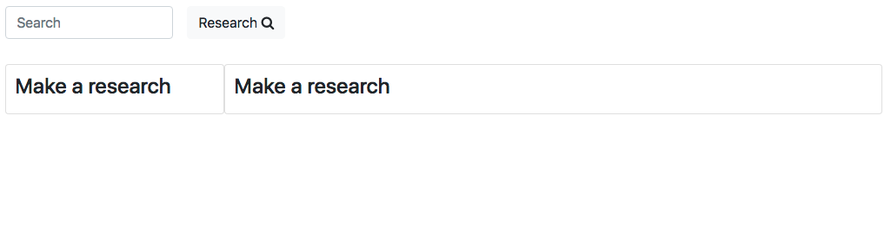
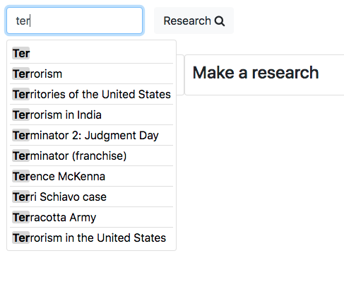
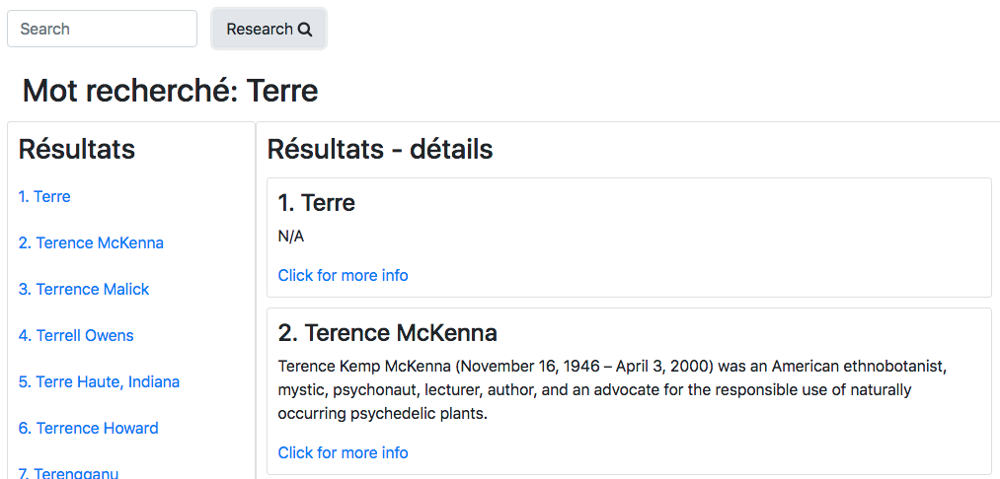

NewWiki
=================================

Project of [Ismail Joseph](https://github.com/Fesouille)
----------------------------------

*Small Exercice for myself*

* Project:
I have to create a website for using wikipedia search only through the wikipedia API. The problem statements for this exercise is limited, as the only objective is to get used to the use of API. 

* Content:
	* HTML file: contains only the research input and button as all other HTML elements are created with javascript.
	
	* CSS file: handles the style of the HTML elements.
	
	* CDN: to access bootstrap library and better manage the layout of the website.

	* Javascript file: this file creates almost all the html content:
		* Accesses the API data with GET method thanks to the research input and button.
		* Creates HTML elements to display the data received by wikipedia. There is a menu on the left displaying the 10 results and the details on the right displaying the description and link to the wikipedia page (the link makes the page collapse right below itself).
		* As extras:
			* it presents a list to suggest the 10 wikipedia results everytime a letter in entered in the research input and allow the user to select the desired result.
			* it compares the letters entered in the research input and the letters of the results suggestions to highlight them while the user is typing.

* Progress Opportunities:
  * Use of keybord keys to navigate through the results suggestions and to launch the research button.
  * Menu of results on the left is not optimized as sometimes its full content is somehow hidden and cannot get accessed.
  * The general style (layout, colors, ...).

* Try it out ! :
	* [NewWiki](https://fesouille.github.io/NewWiki/)

* A few illustrating pictures:

